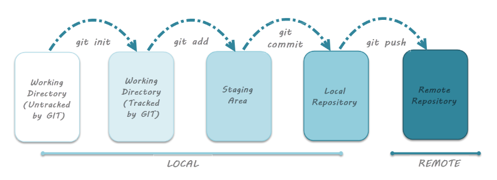

# GIT
### GIT Tutorial Udemy [Link](https://fpt-software.udemy.com/course/git-complete/)



## Command List

## Basic command os
```git
pwd : show path directory

mkdir <name folder> : create new folder

cd <name/path> : go to path folder

rm <file> : remove file

rm -r <dir> delete directory dir last directory
```

## Basic command git
```git
git version: check git version

git config --global <>: config environment global

git clone <link remote repository>: clone repository project in GitHub to Local

ls: show anything in path

git status: check status files in path

git add <file/files/.>: add or change file in Local Area to Stagging Area

git commit -m "<note>": add  or changr file in Stagging Area to Local Repository Area (.git)

git commit -am "<note>": add and commit

git push : up files in Local Repository(.git) to remote repository area ( GitHub ) 

git mv <source> <destination> :  Move or rename a file, a directory, or a symlink

git rm <file> : Remove files from the working tree and from the index

git restore <file> : to discard changes in working directory

git restore --staged <file>: to unstage

```

## Command git log
```git
git log : show list commit log

git log -- <file> : show log of file

git log --since="3 days ago" : show log in 3 last day

git log --all --graph --decorate --oneline: show log commit and show graph and show imple commit

# Git alias
# Config 
git config --global alias.<name alias> "<cmd>"
example: git config --global alias.showloggraph "log --all --graph --decorate --oneline"

git showloggraph = git log --all --graph --decorate --oneline
```

## Command git diff
```git
git diff : Show changes between commits, commit and working tree, etc

git diff HEAD : show changes between working directory and loca repository

git diff --staged HEAD: show changes between stagging area and local repository

git diff -- <file> : show changes in file

git diff <id commit 1> <id commit 2>: show changes between 2 commits

git diff HEAD ^HEAD: show changes between git repository at HEAD and git repository at 1 commit before HEAD

git diff <branch main local> origin/<branch main remote>: show changes between git local and git remote

git diff <branch local A> <branch local B>: show changes between branch A and branch B
```

## Command git branch
```git
git branch: show all branch local

git branch -a: show all branch local and remote

git branch <name branch>: add new branch to local

git checkout <name branch>: change new branch

git branch -m <name old branch> <name new branch> : change name branch

git branch -d <name branch>: delete branch

git branch -b <name new branch>: create new branch and checkout to new branch
``` 


## Command git merge
```git
git merge <branch A>: merge code in branch A to branch here

if branch here dont have commit => fast forward

git merge <branch A> --no-ff: disable fast forward merge
``` 


## Command git rebasing
```git 
git rebase <branch A>: Here to branch A

git rebase --about: check out the original branch and stop rebasing 

git rebase --continue: resolved this problem go next step

git rebase --skip: prefer to skip this patch

``` 

## Command git stashing
```git 
git stash : move all changes in file (old) to other memory

git stash -u : move all changes in file (old and new) to other memory

git stash apply: merge new stash from other memory in here

git stash apply stash@{<index>}: merge stash(index) from other memory in here

git stash list: get list stash in other memory

git stash drop: drop new stash

git stash drop stash@{<index>}: drop stash(index) 

git stash pop : the same 'git stash apply' + 'git stash drop'

git stash save "<message>": config name to stash this is happy if have multiple stashes

git stash show stash@{<index>}: show file change in stash
``` 

